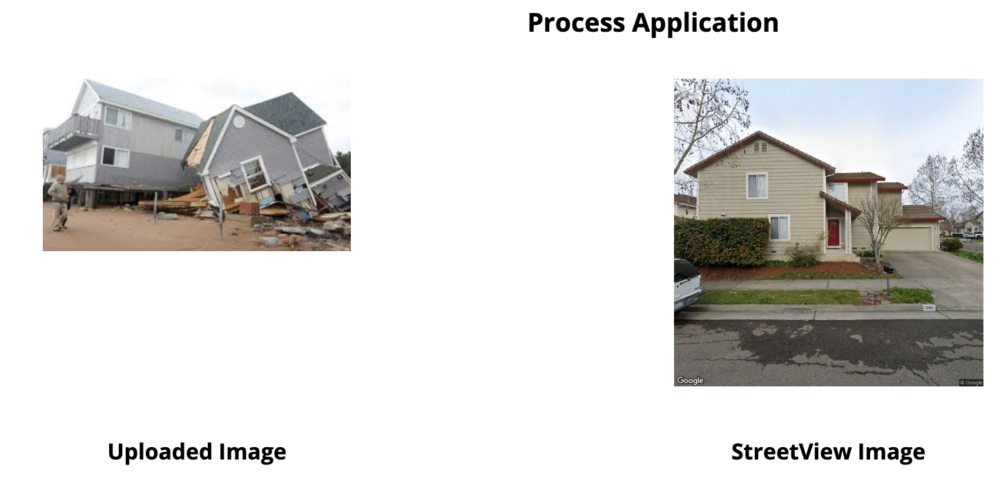

#  Project 5: Client Project

### Overview

**Problem : Using Google Street View as a baseline for damage assessment.**

*Problem Statement:* During the recovery phase immediately following a disaster, 
FEMA performs damage assessment “on the ground” to assess the level of 
damage caused to residential parcels and to critical infrastructure. To assure
 an accurate estimation of the damage, it is important to understand the condition 
 of the structures prior to the event. To help and guide the damage assessment 
 efforts following a disaster and to assist the surveyors identify the structures 
 of interest, `this tool (a web-app or a mobile app)` will expect to get, as an input, 
 a `list of addresses`. It will retrieve `screen shots of the structures from Google 
 Street View`. The students will design a `damage assessment form`, which, in addition 
 to relevant information about the `level of damage to the structures`, will also 
 provide `a pre-event photo` of the assessed structure.

---
**Context :** 

After a manmade or natural disaster like an Earthquake, Hurricane or Flood, 
FEMA (Federal Emergency Management Agency) plays a very important role in meeting the 
needs of affected populations in the United States. Our project’s goal is to provide a tool 
that can rapidly improve the response time in providing aid to affected persons by quickly 
and effectively assessing damaged properties. This tool will access high-quality photos 
from before and after the event using Google Street View. Ultimately, this tool will 
help to help provide an accurate estimation of the damage so that funds can be accurately 
allocated to individuals in need of assistance.

---
**Team :**

    Casey Peacock
    Gouri Krishnamoorthy
    Robert Munoz

___
**Our Solution:** [Propert Damage Estimator](https://fema-damage-report.firebaseapp.com/)

     * Build a web/mobile app 
     * The app will take list of addresses via an application process
     * It will also allow users to upload photos of damaged property
     * It will use the address listed in the application to retieve the pre-event photo from 
       the google street view
     * Then it will analyze the uploaded photos and report the level of damages and calculate 
       loss amount that 
       will have to be considered by FEMA when deciding the payout to the families
     
     Our app simulates a simple way of assessing the damage. 
     Affected persons go to our site (mobile or via computer) and will enter basic information 
     (such as name, affected address, number of persons affected, ID from homeowners 
     such as social security or driver’s license, if the person has home insurance or not, etc). 
     From there, the app will be able to be reviewed by surveyors from FEMA with an already 
     madge estimate created from before and after home data. This process is to estimate funds 
     needed from the U.S government. A complete estimation will be done by in-person surveyors 
     assigned by FEMA to ensure thoroughness.

    
---

**Web App Demo:** [Web App Demo video recording zip file](WEB_APP_DEMO_VIDEO_RECORDING.zip)

---

**Technology used :**

    Python
    scikit-learn
    pandas
    NumPy
    Matplotlib
    React
    Node.js
    Java Script
    React Redux
    Firebase
    Google Vision API
    Rest API
    Rest Server
    Flask

___

**App design Flow:**

    1. Allows user to log into the application using a username/password

    

&nbsp;

    2. Once the user is logged in , the user will be given options to apply, 
       process and report
 

    

 &nbsp;
 
    3. The application takes in the user details along with address and post-event photo of 
       the damaged structure
    4. Next step is to process . Here it will pull the pre-event photo from the google 
       street view based on the address that was given as an input. If the user chooses to 
       process further, it will take the photo uploaded during the application process, put 
       it though Google Vision API , extract lables from the api, run the words through our 
       inbuilt model and determine if it is a damaged property.
       

    
    

 &nbsp;
 
    5. Last step is to look at the results. Following cases are covered:
       a. If the uploaded property is not damaged , it will output "Property not damaged"
       b. If damage is detected , it will check the insured amount:
               If Insured amount covers the property value then :
                       it will putput "Property Damaged, but Insured"
               if Insurance amount does not cover the property value then:
                       it will output "Total Loss: amount" which is calculated by 
                       deducting the insurance payout amount from the property assessed 
                       value
       c. The final loss amount is the value that FEMA will have to consider for 
          calculating how much they may have to pay
          

 
    

 &nbsp;      
 
 ---
 
 **Behind the scenes** 
 
   [Google Vision API](https://cloud.google.com/vision) 
   

 
    

  

   The api takes in any image and outputs all the objects that it can see in that image. 
   This includes 'Geological Phenomenon' or 'Floods' or 'Tornado'
   
   These word list is then processed futher by another model that we developed. 
   
   - This model uses LogisticRegression to predict if the property is damaged or not. 
   - Images selected for this project were collected via an internet search. 
     There are photos of houses in various states of being. Houses range from being 
     fully intact, to partially damaged, to fully damaged or complete rubble.
   - It was created using 200 images of houses that included damaged and undamaged pictures.
   - The accuracy for the test data for this model is 95%
   - It uses CountVectorizer to convert the words to numerical values. 
   - Output : 
         
         1 if the property is intact with no damage
         0 if it detects any words that indicates damage
         -1 if the image, for some reason, could not be processed
   
   This prediction value is updated in the report database against each application . 
   
   The prediction value is taken into account when the report is generated in the final step.
   
  ---

 **Project presentation** 
   
   [Link](project_presentation.pdf)
   
 ___

**Next Steps**

    Demo to the client
    Gather more data
    Test App in situation
    Develop APIs to extract data from the app for further analysis.
    
___

**Additional Credit**

    We did look up previous teams work to see what could help us with our project

    
 
     
       
      
    
 
 
 
 
 
 

